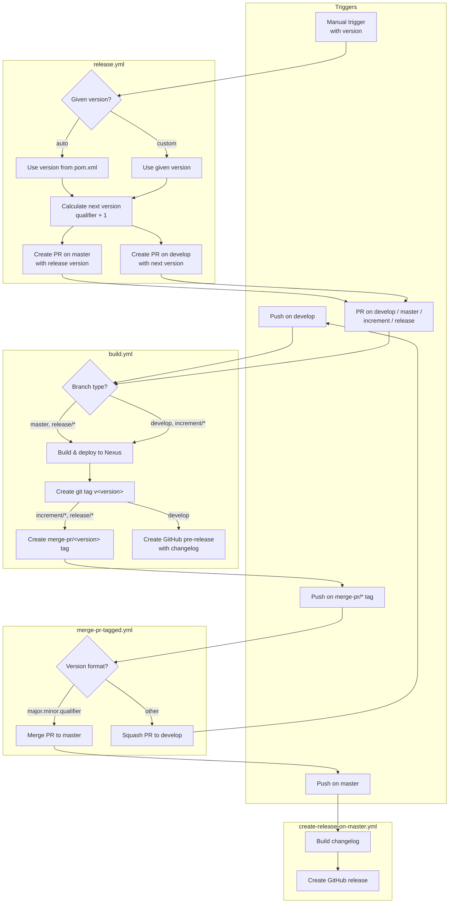

# Development Version and Branch Handling

## Branches

The versioning policy follows [GitFlow](https://www.atlassian.com/git/tutorials/comparing-workflows/gitflow-workflow).

| Branch Pattern | Purpose |
|---|---|
| `develop` | Main development branch — latest development sources of the current active version |
| `feature/JNG-NUMBER_short_summary` | Feature branches based on `develop` for new features |
| `(release/)X.Y.Z` | Release branches (the `release/` prefix is reserved for CI) |
| `bugfix/JNG-NUMBER_short_summary` | Bug fixes based on release branches — must be applied to newer release and develop branches too |
| `support/JNG-NUMBER_short_summary` | Support branches based on release branches for minor changes to previous releases |
| `master` | Latest released sources of the current active version |

```mermaid
gitGraph
    commit id: "init"
    branch develop
    checkout develop
    commit id: "dev-1"
    branch feature/JNG-1
    checkout feature/JNG-1
    commit id: "feat-1"
    commit id: "feat-2"
    checkout develop
    merge feature/JNG-1 id: "merge-feat-1"
    branch feature/JNG-3
    checkout feature/JNG-3
    commit id: "feat-3"
    checkout develop
    merge feature/JNG-3 id: "merge-feat-3"
    branch release/1.0-beta1
    checkout release/1.0-beta1
    commit id: "rc-1"
    branch bugfix/JNG-4
    checkout bugfix/JNG-4
    commit id: "fix-4"
    checkout release/1.0-beta1
    merge bugfix/JNG-4 id: "merge-fix"
    checkout master
    merge release/1.0-beta1 id: "release-1.0"
    checkout develop
    commit id: "dev-2"
    branch release/1.1-beta1
    checkout release/1.1-beta1
    commit id: "rc-2"
    checkout master
    merge release/1.1-beta1 id: "release-1.1"
```

## Version Numbers

Version numbers follow semantic versioning with these rules:

| Event | Version Change |
|---|---|
| Start a `feature/` branch | **No change** — keep the develop version |
| Start a `release/` branch from `develop` | Increment the **2nd number** on `develop` |
| Work on a `bugfix/` branch | **No change** — fixes are applied to the release branch before it merges to master |
| Start a `support/` branch | Increment the **3rd number** — used for minor updates to a previous release |
| Start a `hotfix/` branch | Increment the **4th number** — applied to both release and master branches |

## GitHub Action Flows

The CI/CD pipeline consists of four interconnected workflows:



### build.yml

Triggered on pushes to `develop` and pull requests targeting `develop`, `master`, `increment/*`, or `release/*` branches.

1. **Version resolution:** For `master`/`release/*` branches, the version comes directly from `pom.xml` (without `-SNAPSHOT`). For `develop`/`increment/*`, a qualified version is generated: `major.minor.qualifier.date_commitId_branchName`.
2. **Build and deploy:** Compiles, tests, and deploys artifacts to Nexus.
3. **Tagging:** Creates a git tag `v<version>`. For `increment/*` and `release/*` branches, also creates a `merge-pr/<version>` tag that triggers the merge workflow.
4. **Pre-release:** For `develop` branch, generates a changelog and creates a GitHub pre-release.

### merge-pr-tagged.yml

Triggered when a `merge-pr/*` tag is pushed.

- If the version is in `major.minor.qualifier` format: **merges** the PR to `master` (triggers `create-release-on-master.yml`)
- Otherwise: **squashes** the PR to `develop` (triggers `build.yml`)
- Cleans up the `merge-pr/<version>` tag afterwards.

### create-release-on-master.yml

Triggered on pushes to `master`. Builds a changelog and creates a final GitHub release.

### release.yml

Manually triggered with a version parameter (`auto` or a specific `major.minor.qualifier`).

1. Resolves the release version (from `pom.xml` if `auto`)
2. Calculates the next development version (qualifier + 1)
3. Creates two PRs: one targeting `master` with the release version, one targeting `develop` with the next version

## How to Develop

Issue tracking uses [JIRA](https://blackbelt.atlassian.net/jira/dashboards).

> **Important:** There is no commit without a ticket number. Every pull request and commit must reference a `JNG-xxx` ticket.
