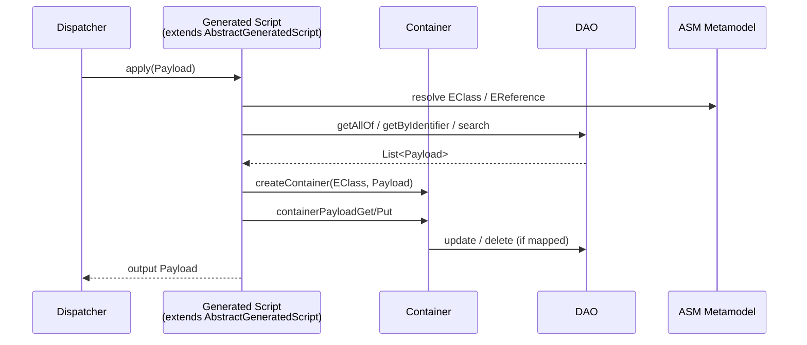
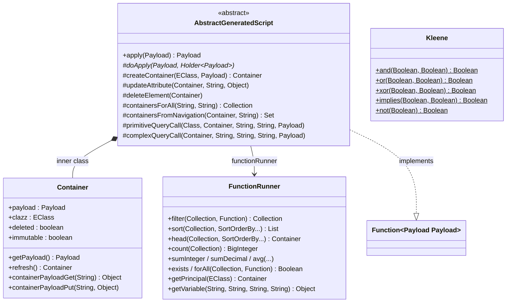
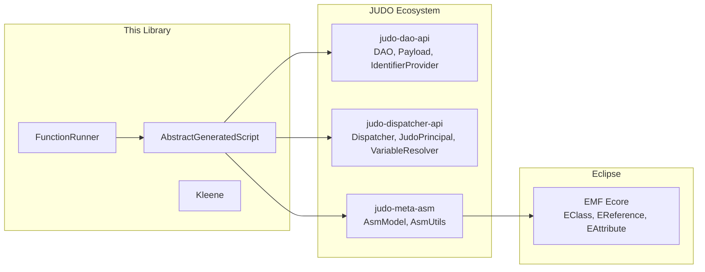

# judo-operation-utils

[](https://github.com/BlackBeltTechnology/judo-operation-utils/actions/workflows/build.yml)

## Introduction

`judo-operation-utils` provides runtime utility classes that generated JUDO operation scripts depend on. When a JUDO model defines custom operations (business logic), those operations are compiled into Java classes that extend `AbstractGeneratedScript`. This library supplies that base class along with collection/query helpers (`FunctionRunner`) and three-valued logic (`Kleene`).

It is consumed by the [judo-runtime-core](https://github.com/BlackBeltTechnology/judo-runtime-core) Dispatcher, which instantiates generated scripts, injects the DAO layer and metamodel, and invokes them as `Function<Payload, Payload>`.

## How It Works

The library sits between the JUDO metamodel layer and the persistence layer, giving generated scripts a high-level API to manipulate transfer objects without writing raw DAO calls.



## Architecture



### Container Identity Model

Containers use a dual-identity scheme to track both persisted and transient objects:

| Payload Key | Meaning |
|---|---|
| `__identifier` | UUID of a **mapped** (persisted) transfer object |
| `__unmappedid` | UUID of a **transient** (unmapped) object |
| `__mutable_identifier` | Stored on **immutable copies** — holds the original mapped UUID so the object can be made mutable again |
| `__toType` | Fully qualified transfer object type name |
| `__entityType` | Underlying entity type (used for type-assignability checks) |

## Key Dependencies



## Build

```bash
# Full build
./mvnw clean install

# Build without tests
./mvnw clean install -DskipTests

# Run tests
./mvnw test

# Run a single test
./mvnw test -Dtest=ClassName#methodName
```

## Context

This project is a building block of the [judo-community](https://github.com/BlackBeltTechnology/judo-community) aggregator project. Check the corresponding documentation to understand how this module fits into the ecosystem.

## Contributing

See [CONTRIBUTING.md](CONTRIBUTING.md) for details on submitting issues and pull requests.

## License

This project is licensed under the [Eclipse Public License - v 2.0](https://www.eclipse.org/legal/epl-2.0/).
